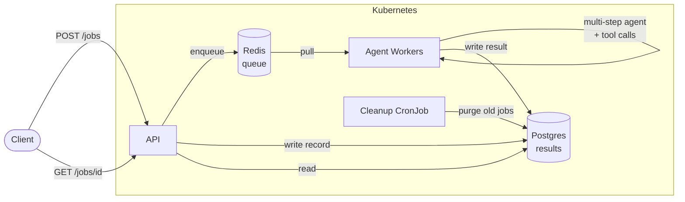
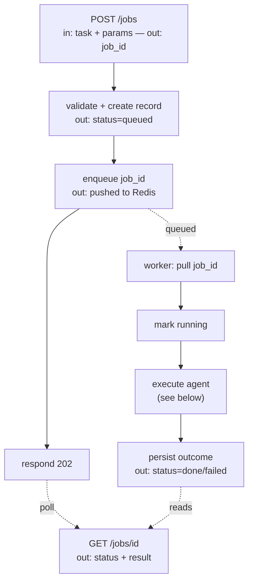
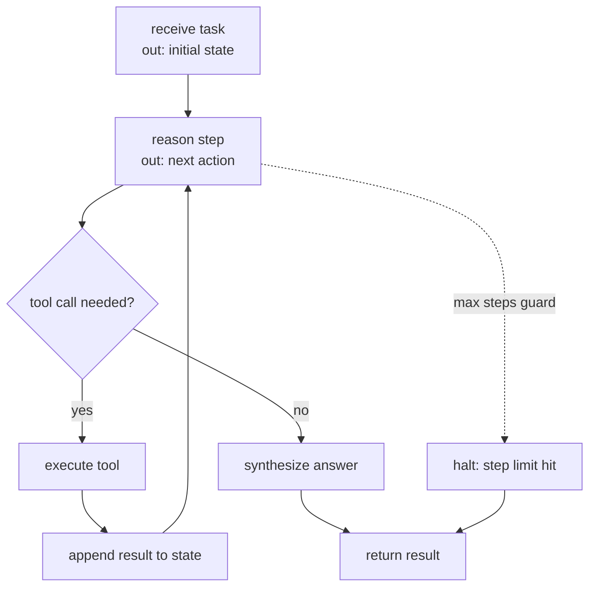

# agent-conductor

Kubernetes-native platform for running long-running **agentic jobs**. Submit a job over an API, a pool of workers pulls it off a queue and runs a multi-step agent, and results are persisted and streamed back. Workers autoscale on queue depth.

Built as a study in doing stateful, bursty AI workloads the way infrastructure actually wants them done.


## Why

The workload (agentic jobs) exists to exercise the infrastructure: submission and execution are decoupled through a queue, so the API and the workers scale independently. That decoupling is what makes the Kubernetes side worth doing.

## Stack

Python · FastAPI · LangGraph · Redis (queue) · Postgres (results) · Docker · Kubernetes · KEDA (queue-based autoscaling)

## Architecture



| Component | Kubernetes object | Why |
|---|---|---|
| API | Deployment + Service + HPA | Stateless, scalable, load-balanced |
| Agent workers | Deployment, scaled on queue depth (KEDA) | Count tracks pending work |
| Redis (queue) | StatefulSet + PVC | Stateful, needs persistence |
| Postgres (results) | StatefulSet + PVC | Data survives pod restarts |
| Cleanup | CronJob | Scheduled background work |
| Config / secrets | ConfigMap + Secret | No secrets baked into images |
| Entry point | Ingress | Single way into the cluster |

## Job lifecycle



## Agent execution



## Project layout

```
app/
  api/      FastAPI — submit + status endpoints
  worker/   queue consumer + agent runner
  agent/    LangGraph agent graph + tools
  shared/   models, db, queue client, logging, config
k8s/        manifests (base + local/cloud overlays)
docker/     Dockerfiles
```